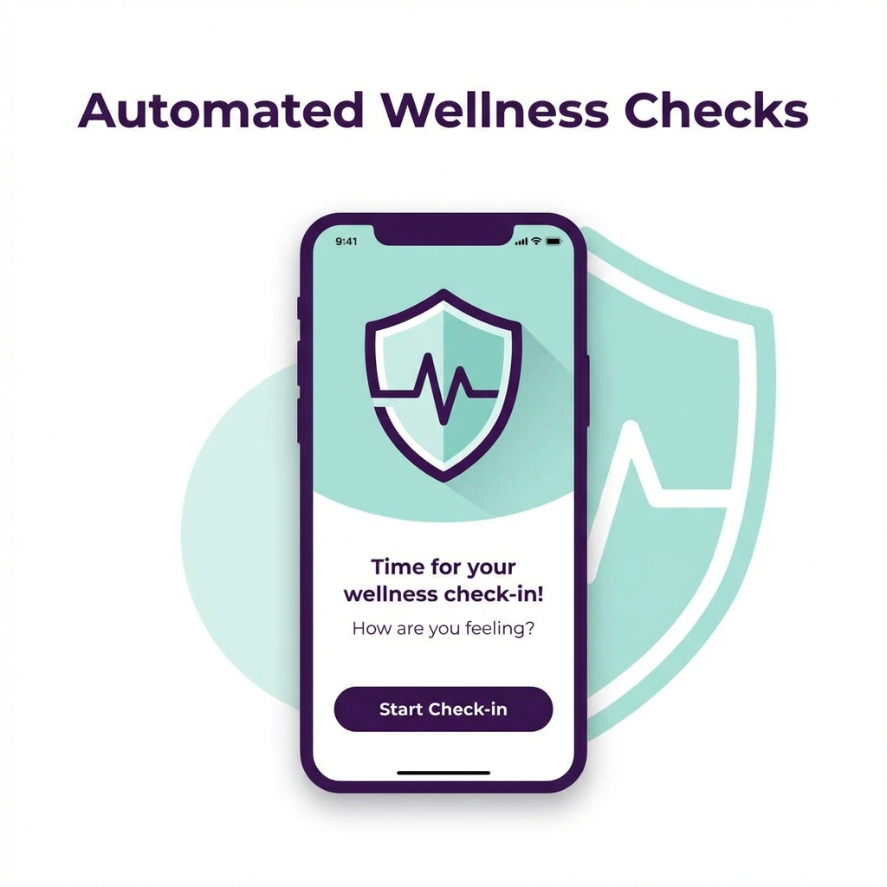
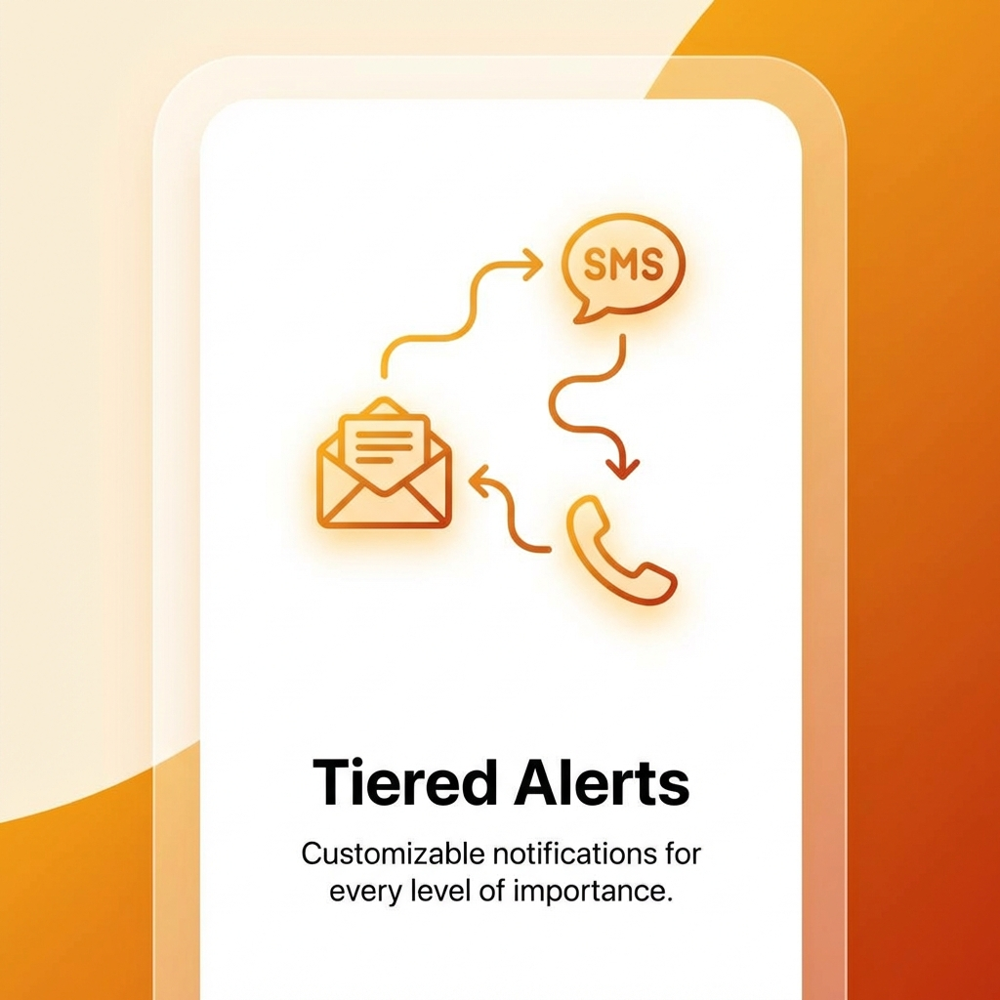

<p align="center">
  
</p>

<h1 align="center">Is He Dead?</h1>

<p align="center">
  <strong>A Digital Dead Man's Switch — Built with Flutter & Firebase</strong>
</p>

<p align="center">
  <em>Because your digital life, passwords, and final messages should reach the right people — on your terms.</em>
</p>

<p align="center">
  
  
  
  
</p>

<p align="center">
  
  
  
</p>

---

## 💀 What Is This?

**Is He Dead?** is a mobile **Dead Man's Switch** application. It monitors your activity through periodic check-ins. If you fail to confirm you're alive within a configurable time window, the app automatically:

1. 📧 **Sends email alerts** to your trusted contacts
2. 📱 **Dispatches SMS warnings** via Twilio
3. 📞 **Initiates automated voice calls** as a final measure
4. 🔓 **Releases your Digital Vault** (encrypted documents, Will, etc.)
5. 💌 **Delivers your Legacy Message** to designated loved ones
6. 🏥 **Shares your Medical ID** with authorized contacts

> Think of it as a safety net for solo travelers, people with medical conditions, or anyone who wants peace of mind knowing their critical information won't be lost.

---

## ✨ Key Features

### 🫀 The Heartbeat — "I Am Alive" Check-In
A pulsating button on the home screen. One tap confirms you're okay and resets the countdown timer. Miss it, and the protocol begins.

### 🛡️ 3-Tier Escalation Protocol

| Tier | Trigger | Action |
|:----:|:--------|:-------|
| ⚠️ **Level 1** | Frequency + 2 hours | Email alerts sent. Medical ID shared with authorized contacts. |
| 🔴 **Level 2** | Frequency + 24 hours | Urgent SMS dispatched to all trusted contacts. |
| 💀 **Level 3** | Frequency + 48 hours | Full protocol execution — Voice calls, Vault release, Legacy Message delivery. |

### 🏥 Medical ID
Store your blood type, allergies, medications, and medical notes. Shared with first responders and authorized contacts during emergencies.

### 🔒 Digital Vault
Securely upload your Will, insurance documents, and critical files to Firebase Storage. Released only when the protocol executes.

### 💌 Legacy Message
Write a final message to your loved ones. Delivered via email when the Dead Man's Switch activates.

### 👥 Trusted Contacts (Inner Circle)
Add up to 5 emergency contacts with granular permissions:
- **Vault Access** — Can receive your encrypted documents
- **Legacy Message** — Can receive your final message
- **Medical Info** — Can receive your Medical ID

### 🚨 Panic Button
Manually trigger the emergency protocol instantly from Settings. For situations where you need immediate help.

### 🌙 Dark Mode
Premium dark and light themes with glassmorphism UI elements throughout.

---

## 🏗️ Architecture

The app follows a **feature-first architecture** with clean separation of concerns:

```
lib/
├── main.dart                          # App entry point
├── firebase_options.dart              # Firebase configuration
│
├── core/                              # Shared infrastructure
│   ├── common/                        # Reusable widgets (GlassPhoneField)
│   ├── providers/                     # Global providers (Theme, Onboarding)
│   ├── router/                        # GoRouter configuration & auth guards
│   ├── services/                      # Core services (Notifications)
│   ├── theme/                         # Design system (VaultStyles)
│   ├── utils/                         # Utilities (ErrorParser, ToastUtils)
│   └── widgets/                       # Shell widgets (ScaffoldWithNavBar)
│
├── features/
│   ├── auth/                          # Authentication
│   │   ├── auth_provider.dart         # Auth state management
│   │   ├── auth_service.dart          # Firebase Auth + Google Sign-In
│   │   ├── login_screen.dart          # Glassmorphism login
│   │   ├── register_screen.dart       # Registration with phone
│   │   ├── complete_profile_screen.dart # Setup wizard
│   │   └── email_verification_screen.dart
│   │
│   ├── home/
│   │   └── screens/
│   │       ├── home_screen.dart       # Dashboard with pulse button
│   │       └── protocol_status_screen.dart # Timeline view
│   │
│   ├── medical/
│   │   ├── models/medical_info.dart   # Blood type, allergies, meds
│   │   └── screens/medical_id_screen.dart
│   │
│   ├── onboarding/
│   │   └── screens/onboarding_screen.dart
│   │
│   ├── profile/
│   │   ├── models/                    # UserProfile, EmergencyContact
│   │   ├── screens/                   # Profile, Contacts, Documents, Legacy
│   │   └── services/                  # Firestore CRUD, Storage
│   │
│   └── settings/
│       └── screens/                   # Settings, Account, Privacy Policy
│
functions/                             # Firebase Cloud Functions (Node.js)
├── index.js                           # Scheduled inactivity monitor
├── monitor_logic.js                   # Tier-based escalation engine
└── notifications.js                   # Email (Nodemailer), SMS & Calls (Twilio)
```

---

## 🛠️ Tech Stack

| Layer | Technology |
|:------|:-----------|
| **Frontend** | Flutter 3.10+ (Dart) |
| **State Management** | Riverpod (flutter_riverpod) |
| **Navigation** | GoRouter with auth-aware redirects |
| **Backend** | Firebase (Auth, Firestore, Storage, Cloud Functions) |
| **Authentication** | Email/Password + Google Sign-In |
| **Notifications** | flutter_local_notifications + Firebase Cloud Functions |
| **Email Service** | Nodemailer (Gmail SMTP) |
| **SMS & Calls** | Twilio API |
| **UI Design** | Glassmorphism, Material 3, Dark/Light themes |

---

## 🔄 How The Protocol Works

```
┌─────────────────┐
│   User Checks In │ ──► Timer Resets ──► System Active ✅
│   ("I AM ALIVE") │
└────────┬────────┘
         │
         │  Timer expires (configurable: 1-3 days)
         ▼
┌─────────────────┐
│   ⚠️ TIER 1     │ ──► Email alerts + Medical ID shared
│   (+2 hours)     │
└────────┬────────┘
         │
         │  No response for 24 hours
         ▼
┌─────────────────┐
│   🔴 TIER 2     │ ──► Urgent SMS to all contacts
│   (+24 hours)    │
└────────┬────────┘
         │
         │  No response for 48 hours
         ▼
┌─────────────────┐
│   💀 TIER 3     │ ──► Voice calls + Vault + Legacy Message
│   (+48 hours)    │     User marked INACTIVE
└─────────────────┘
```

A **Cloud Function** runs every 60 minutes to check all active users and escalate tiers as needed.

---

## 📱 Screenshots

> Add your own screenshots here! Replace the placeholders below.

<p align="center">
  
  &nbsp;&nbsp;
  
  &nbsp;&nbsp;
  
</p>

<!-- 
Add more screenshots:
<p align="center">
  
  
  
</p>
-->

---

## 🚀 Getting Started

### Prerequisites

- [Flutter SDK](https://flutter.dev/docs/get-started/install) (3.10+)
- [Firebase CLI](https://firebase.google.com/docs/cli)
- [Node.js](https://nodejs.org/) (for Cloud Functions)
- Android Studio / Xcode (for emulators)

### 1. Clone the Repository

```bash
git clone https://github.com/YOUR_USERNAME/ishedead.git
cd ishedead
```

### 2. Install Flutter Dependencies

```bash
flutter pub get
```

### 3. Firebase Setup

```bash
# Install Firebase CLI if not already installed
npm install -g firebase-tools

# Login to Firebase
firebase login

# Initialize Firebase (or use existing config)
flutterfire configure
```

### 4. Cloud Functions Setup

```bash
cd functions
npm install
```

#### Configure Secrets (for production)

```bash
firebase functions:config:set \
  nodemailer.email="your-email@gmail.com" \
  nodemailer.password="your-app-password" \
  nodemailer.service="gmail" \
  twilio.sid="AC_YOUR_SID" \
  twilio.token="YOUR_AUTH_TOKEN" \
  twilio.from="+1234567890"
```

### 5. Run the App

```bash
# Start Firebase Emulators (for local development)
firebase emulators:start

# Run the Flutter app
flutter run
```

### 6. Deploy Cloud Functions (Production)

```bash
firebase deploy --only functions
```

---

## 🧪 Firebase Emulator Setup

The app is configured to use Firebase emulators in debug mode:

| Service | Port |
|:--------|:-----|
| Auth | 9099 |
| Firestore | 8090 |
| Storage | 9199 |
| Functions | 5001 |
| Emulator UI | 4000 |

Start all emulators:
```bash
firebase emulators:start
```

---

## 🔐 Security & Privacy

- **Client-side encryption** for sensitive vault documents
- **Granular contact permissions** — each contact has explicit access flags
- **Email verification** required before account activation
- **Firebase Security Rules** protect all database and storage access
- **No data shared** unless the protocol is explicitly triggered
- All communication via **encrypted channels** (HTTPS, TLS)

---

## 📂 Cloud Functions

| Function | Type | Description |
|:---------|:-----|:------------|
| `checkInactivity` | Scheduled (60 min) | Scans all active users, escalates tiers |
| `debugAlert` | Callable | Test alerts (email/SMS/call) + Panic button |
| `manualRunMonitor` | HTTP | Manual inactivity check trigger |
| `testLocalFunction` | HTTP | Emulator connection test |

---

## 🤝 Contributing

Contributions are welcome! Here's how:

1. **Fork** the repository
2. **Create** a feature branch (`git checkout -b feature/amazing-feature`)
3. **Commit** your changes (`git commit -m 'Add amazing feature'`)
4. **Push** to the branch (`git push origin feature/amazing-feature`)
5. **Open** a Pull Request

### Code Style
- Follow the [Effective Dart](https://dart.dev/effective-dart) guidelines
- Use the analysis rules defined in `analysis_options.yaml`
- Keep features self-contained within their feature directory

---

## 📄 License

This project is licensed under the **MIT License** — see the [LICENSE](LICENSE) file for details.

---

## 🙏 Acknowledgements

- [Flutter](https://flutter.dev/) — Beautiful native apps in record time
- [Firebase](https://firebase.google.com/) — Backend-as-a-Service
- [Riverpod](https://riverpod.dev/) — Reactive state management
- [GoRouter](https://pub.dev/packages/go_router) — Declarative routing
- [Twilio](https://www.twilio.com/) — SMS & Voice APIs
- [Nodemailer](https://nodemailer.com/) — Email delivery

---

<p align="center">
  <strong>Built with ❤️ and a healthy dose of existential awareness</strong>
</p>

<p align="center">
  <em>"The best time to prepare was yesterday. The second best time is now."</em>
</p>
